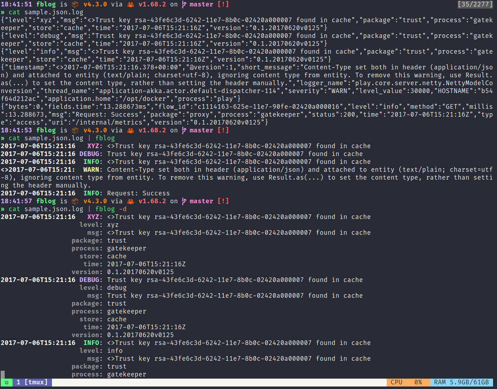

# fblog


A small tool to view json log files.



## Print specific fields

``` shell-script
fblog -a message -a "status > a" sample_nested.json.log
```

## Prefix Logs

If your query docker or kubectl for multiple pods it will prefix the log
lines: `PODNAME | {"message": "test"}`. `fblog` can parse this and add
it to the message. Just use `-p`.

## Filter

To filter log messages it is possible to use lua. If you are unsure
which variables are available you can use `--print-lua` to see the code
generated by fblog.

```bash
fblog -f 'level ~= "info"' # will print all message where the level is not info
fblog -f 'process == "play"' # will print all message where the process is play
fblog -f 'string.find(fu, "bow.*") ~= nil' # will print all messages where fu starts with bow
fblog -f 'process == "play"' # will print all message where the process is play
fblog -f 'process == "rust" and fu == "bower"'
fblog --no-implicit-filter-return-statement -f 'if 3 > 2 then return true else return false end'

# not valid lua identifiers like log.level gets converted to log_level.
# Every character that is not _ or a letter will be converted to _
fblog -d -f 'log_level == "WARN"' sample_elastic.log

# nested fields are converted to lua records
fblog  -d -f 'status.a == 100' sample_nested.json.log

# array fields are converted to lua tables (index starts with 1)
fblog  -d -f 'status.d[2] == "a"' sample_nested.json.log
```

## Customize

`fblog` tries to detect the message, severity and timestamp of a log
entry. This behavior can be customized. See `--help` for more
information.

You can customize fblog messages: Format output:

``` shell-script
fblog -p --main-line-format "{{#if short_message}}{{ red short_message }}{{/if}}" sample.json.log
```

The following sanitized variables are provided by fblog:

-   fblog_timestamp
-   fblog_level
-   fblog_message
-   fblog_prefix

For the default formatting see `--help`

Nested values are registered as objects. So you can use `nested.value`
to access nested values.

handlebar helpers:

-   bold
-   yellow
-   red
-   blue
-   purple
-   cyan
-   green
-   color_rgb 0 0 0
-   uppercase
-   level_style
-   fixed_size 10
-   min_size 10

## NO_COLOR

`fblog` disables color output if the `NO_COLOR` environment variable is
present.

[no-color](https://no-color.org/)

## Message placeholder substitution

Placeholders in the message (`fblog_message`) can be substituted with
their corresponding values in a context object or array. To enable
substitutions, pass the `-s` flag or either set context key
(`-c context`) or placeholder format (`-F {key}`).

Note that the placeholder format should be written like
`<PREFIX>key<SUFFIX>`, where it would match a placeholder with the key
`key`.

### Example

Given the following log (referred to as `example.log`):

``` json
{"message": "Found #{count} new items.", "extra_data": {"count": 556}, "level": "info"}
```

Running with the following arguments:

``` bash
fblog -c extra_data -F '#{key}' example.log
```

Result:


## Installation

``` bash
cargo install fblog
```

Available in package managers:
[AUR](https://aur.archlinux.org/packages/fblog/),
[brew](https://formulae.brew.sh/formula/fblog)

## Log tailing

`fblog` does not support native log tailing but this is easily
achiveable.

``` bash
tail -f file | fblog
```

Or with kubernetes tooling for example

``` bash
kubectl logs -f ... | fblog
```

In general you can pipe any endless stream to fblog.


## shell completions

```bash
fblog --generate-completions <shell>
```


## configuration file

`fblog` reads its configuration from a file called `fblog.toml`, which is located

Linux: `$XDG_CONFIG_HOME` or `$HOME/.config`

Windows: `{FOLDERID_RoamingAppData}`

macOS: `$HOME/Library/Application Support`

If the file does not exist or is empty [this](./default_config.toml) is the default config.


## log levels
These levels are colorized by fblog:

```
trace
debug
info
warn
error
fatal
```

You can map additional level values (used for output and color):
```toml
[level_map]
10 = "trace"
20 = "debug"
30 = "info"
40 = "warn"
50 = "error"
60 = "fatal"
# these values for example are used by https://www.npmjs.com/package/bunyan#levels
```

## k9s

In the file `~/.config/k9s/plugins.yml` add this:

```yaml
plugins:
  fblog-pod:
    shortCut: Shift-L
    confirm: false
    description: "fblog"
    scopes:
      - pods
    command: sh
    background: false
    args:
      - -c
      - "kubectl logs --follow -n $NAMESPACE $NAME | fblog"
  fblog-container:
    shortCut: Shift-L
    confirm: false
    description: "fblog"
    scopes:
      - containers
    command: sh
    background: false
    args:
      - -c
      - "kubectl logs  --follow -n $NAMESPACE $POD -c $NAME | fblog"
  fblog-pod-all:
    shortCut: Shift-K
    confirm: false
    description: "fblog -d"
    scopes:
      - pods
    command: sh
    background: false
    args:
      - -c
      - "kubectl logs --follow -n $NAMESPACE $NAME | fblog -d"
  fblog-container-all:
    shortCut: Shift-K
    confirm: false
    description: "fblog -d"
    scopes:
      - containers
    command: sh
    background: false
    args:
      - -c
      - "kubectl logs  --follow -n $NAMESPACE $POD -c $NAME | fblog -d"
```
